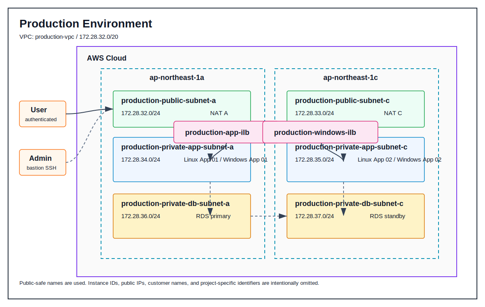

# aws-windows-ilb-poc

Windows Server と内部ロードバランサーを含む業務システム基盤を、公開用に抽象化した PoC ケーススタディです。

実務で扱った検証環境と本番環境の構成をもとに、VPC、Public / Private Subnet、NAT Gateway、Linux / Windows Server、Internal Load Balancer、RDS の役割と差分を整理しています。

公開にあたり、リソース名、インスタンス ID、グローバル IP、顧客情報、案件名、拠点情報、接続先情報は記載しません。

<br>

## 概要

このリポジトリでは、Windows Server を Private Subnet に配置し、内部ロードバランサー経由で通信を集約する構成を扱います。

検証環境では接続経路とアプリケーション動作を確認し、本番環境では 2AZ 構成、NAT Gateway 冗長化、Linux / Windows Server の複数台構成、RDS Multi-AZ を前提に整理しています。

<br>

## リポジトリの目的

- Windows Server を含む AWS 基盤構成の理解を示す
- 検証環境と本番環境の構成差分を説明できる形にする
- 内部ロードバランサーを利用する理由を、非公開構成、可用性、運用性の観点で整理する
- 実務由来の構成を、公開可能なドキュメントと CloudFormation サンプルへ抽象化する
- 後から再現・説明しやすいポートフォリオ用リポジトリとして整える

<br>

## アーキテクチャ

構成図は、実務PPTX原本をそのまま配置せず、公開用の名称へ置き換えて作成しています。

| 環境 | 構成図 | 内容 |
| --- | --- | --- |
| 検証環境 | [diagrams/windows-ilb-validation-architecture.svg](diagrams/windows-ilb-validation-architecture.svg) | 接続経路、最小サーバー構成、Single-AZ RDS を確認する環境 |
| 本番環境 | [diagrams/windows-ilb-production-architecture.svg](diagrams/windows-ilb-production-architecture.svg) | 2AZ、NAT Gateway x2、Linux / Windows Server x2、RDS Multi-AZ を想定した環境 |



詳細は [docs/architecture.md](docs/architecture.md) に整理しています。

<br>

## 検証環境と本番環境

| 観点 | 検証環境 | 本番環境 |
| --- | --- | --- |
| 目的 | 接続経路、アプリケーション動作、DB接続の確認 | 可用性、運用性、障害時の影響範囲を考慮した構成 |
| VPC CIDR | `172.28.48.0/20` | `172.28.32.0/20` |
| AZ | `ap-northeast-1a` / `ap-northeast-1c` | `ap-northeast-1a` / `ap-northeast-1c` |
| NAT Gateway | 1台 | AZごとに1台 |
| Linux Server | 1台 | 2台 |
| Windows Server | 1台 | 2台 |
| Internal ALB | Linux 用 / Windows 用 | Linux 用 / Windows 用 |
| RDS | PostgreSQL / Single-AZ | PostgreSQL / Multi-AZ |
| 主な確認観点 | 経路確認、疎通確認、機能確認 | 冗長化、切り離し、メンテナンス、障害時対応 |

<br>

## 作成される主な AWS リソース

CloudFormation サンプルでは、検証環境と本番環境の 2 種類の構成を作成できます。

| リソース | 検証環境 | 本番環境 |
| --- | --- | --- |
| VPC | 1個 | 1個 |
| Public Subnet | 2個 | 2個 |
| Private App Subnet | 2個 | 2個 |
| Private DB Subnet | 2個 | 2個 |
| Internet Gateway | 1個 | 1個 |
| NAT Gateway | 1個 | 2個 |
| EC2 | 踏み台 x1、Linux x1、Windows x1 | 踏み台 x1、Linux x2、Windows x2 |
| Internal ALB | Linux 用 x1、Windows 用 x1 | Linux 用 x1、Windows 用 x1 |
| RDS | PostgreSQL / Single-AZ | PostgreSQL / Multi-AZ |
| Security Group | 役割単位で作成 | 役割単位で作成 |

<br>

## CloudFormation テンプレート

| テンプレート | 内容 |
| --- | --- |
| [templates/validation-windows-ilb.yaml](templates/validation-windows-ilb.yaml) | 検証環境をもとにした VPC、Subnet、NAT Gateway、EC2、Internal ALB、RDS、Security Group |
| [templates/prod-windows-ilb.yaml](templates/prod-windows-ilb.yaml) | 本番環境をもとにした VPC、Subnet、NAT Gateway、EC2、Internal ALB、RDS、Security Group |

このテンプレートは公開用の PoC サンプルです。実務構成をそのまま再現するものではありません。

Linux Server には Apache HTTP Server、Windows Server には IIS と簡易HTMLを配置し、Internal Load Balancer のヘルスチェックと振り分けを確認できる最小構成にしています。

<br>

## パラメータファイル

パラメータファイルのサンプルは以下に配置しています。

| ファイル | 内容 |
| --- | --- |
| [parameters/validation.example.json](parameters/validation.example.json) | 検証環境向けのサンプルパラメータ |
| [parameters/prod.example.json](parameters/prod.example.json) | 本番環境向けのサンプルパラメータ |

実際にデプロイする場合は、サンプルファイルをコピーして使用します。

```bash
cp parameters/validation.example.json parameters/validation.json
cp parameters/prod.example.json parameters/prod.json
```

`parameters/validation.json` と `parameters/prod.json` には、自分の環境に合わせた値を設定します。実環境の値を含むため、GitHub にはコミットしない運用とします。

<br>

## パラメータ

| パラメータ | 検証環境デフォルト | 本番環境デフォルト | 説明 |
| --- | --- | --- | --- |
| `ProjectName` | `aws-windows-ilb-poc` | `aws-windows-ilb-poc` | リソース名の接頭辞 |
| `EnvironmentName` | `stg` | `prod` | 環境識別子 |
| `VpcCidr` | `172.28.48.0/20` | `172.28.32.0/20` | VPC CIDR |
| `PublicSubnetACidr` | `172.28.48.0/24` | `172.28.32.0/24` | Public Subnet A |
| `PublicSubnetCCidr` | `172.28.49.0/24` | `172.28.33.0/24` | Public Subnet C |
| `PrivateAppSubnetACidr` | `172.28.50.0/24` | `172.28.34.0/24` | Private App Subnet A |
| `PrivateAppSubnetCCidr` | `172.28.51.0/24` | `172.28.35.0/24` | Private App Subnet C |
| `PrivateDbSubnetACidr` | `172.28.52.0/24` | `172.28.36.0/24` | Private DB Subnet A |
| `PrivateDbSubnetCCidr` | `172.28.53.0/24` | `172.28.37.0/24` | Private DB Subnet C |
| `AllowedAdminCidr` | なし | なし | 踏み台サーバーへ SSH 接続する管理元CIDR |
| `KeyName` | なし | なし | EC2 キーペア名 |
| `LinuxAmiId` | なし | なし | Amazon Linux 2023 AMI ID |
| `WindowsAmiId` | なし | なし | Windows Server AMI ID |
| `BastionInstanceType` | `t3a.small` | `t3a.small` | 踏み台サーバーのインスタンスタイプ |
| `LinuxInstanceType` | `t3a.medium` | `m6a.xlarge` | Linux Server のインスタンスタイプ |
| `WindowsInstanceType` | `t3a.medium` | `m6a.xlarge` | Windows Server のインスタンスタイプ |
| `DbInstanceClass` | `db.m6g.large` | `db.m6g.large` | RDS インスタンスクラス |
| `DbAllocatedStorage` | `100` | `200` | RDS ストレージサイズ |
| `DbPort` | `5432` | `5432` | PostgreSQL 接続ポート |
| `DbMultiAz` | なし | `true` | RDS Multi-AZ の有効化 |
| `DbMasterPassword` | なし | なし | RDS 管理ユーザーのパスワード |

<br>

## ディレクトリ構成

```text
.
├── README.md
├── diagrams
│   ├── README.md
│   ├── windows-ilb-production-architecture.svg
│   └── windows-ilb-validation-architecture.svg
├── docs
│   ├── architecture.md
│   └── operations.md
├── examples
│   └── naming-and-parameters.example.md
├── parameters
│   ├── prod.example.json
│   └── validation.example.json
└── templates
    ├── prod-windows-ilb.yaml
    └── validation-windows-ilb.yaml
```

<br>

## 前提条件

- AWS CLI が利用できること
- CloudFormation スタックを作成できる IAM 権限があること
- EC2 キーペアを作成済みであること
- Amazon Linux 2023 と Windows Server の AMI ID を確認していること
- RDS パスワードを安全な値で用意していること

<br>

## デプロイ・運用方法

### パラメータ準備

```bash
cp parameters/validation.example.json parameters/validation.json
cp parameters/prod.example.json parameters/prod.json
```

`parameters/validation.json` と `parameters/prod.json` の以下の値を、自分の環境に合わせて変更します。

| プレースホルダー | 設定内容 |
| --- | --- |
| `<YOUR_ADMIN_IP>/32` | 踏み台サーバーへ SSH 接続する管理元グローバルIP |
| `<YOUR_KEY_NAME>` | EC2 キーペア名 |
| `<YOUR_AL2023_AMI_ID>` | Amazon Linux 2023 AMI ID |
| `<YOUR_WINDOWS_AMI_ID>` | Windows Server AMI ID |
| `<YOUR_DB_MASTER_PASSWORD>` | RDS 管理ユーザーのパスワード |

### テンプレート検証

```bash
aws cloudformation validate-template \
  --template-body file://templates/validation-windows-ilb.yaml

aws cloudformation validate-template \
  --template-body file://templates/prod-windows-ilb.yaml
```

### スタック作成

検証環境を作成する場合:

```bash
aws cloudformation create-stack \
  --stack-name aws-windows-ilb-poc-validation \
  --template-body file://templates/validation-windows-ilb.yaml \
  --parameters file://parameters/validation.json
```

本番環境を作成する場合:

```bash
aws cloudformation create-stack \
  --stack-name aws-windows-ilb-poc-prod \
  --template-body file://templates/prod-windows-ilb.yaml \
  --parameters file://parameters/prod.json
```

### スタック状態確認

```bash
aws cloudformation describe-stacks \
  --stack-name aws-windows-ilb-poc-validation

aws cloudformation describe-stacks \
  --stack-name aws-windows-ilb-poc-prod
```

### 動作確認

- 踏み台サーバーへ管理者端末から SSH 接続できること
- 踏み台サーバー経由で Private Subnet 内の Linux / Windows Server へ接続できること
- Internal ALB のDNS名で、Linux / Windows Server 上のサンプルページへ通信できること
- Linux / Windows Server から RDS エンドポイントへ接続できること

### スタック更新

```bash
aws cloudformation update-stack \
  --stack-name aws-windows-ilb-poc-validation \
  --template-body file://templates/validation-windows-ilb.yaml \
  --parameters file://parameters/validation.json

aws cloudformation update-stack \
  --stack-name aws-windows-ilb-poc-prod \
  --template-body file://templates/prod-windows-ilb.yaml \
  --parameters file://parameters/prod.json
```

### スタック削除

```bash
aws cloudformation delete-stack \
  --stack-name aws-windows-ilb-poc-validation

aws cloudformation delete-stack \
  --stack-name aws-windows-ilb-poc-prod
```

RDS は `DeletionPolicy: Snapshot` を指定しているため、削除時にスナップショットが作成されます。

<br>

## 設計上の補足

本番環境では、業務アプリケーションを稼働する Linux / Windows Server を Private Subnet に配置し、外部から直接到達できない構成とします。

複数台のサーバーに対する通信を内部ロードバランサーに集約することで、利用側の接続先を固定しつつ、ヘルスチェック、冗長化、メンテナンス時の切り離しを行いやすくしています。

<br>

## 参考ドキュメント

- [docs/architecture.md](docs/architecture.md)
- [docs/operations.md](docs/operations.md)
- [examples/naming-and-parameters.example.md](examples/naming-and-parameters.example.md)
