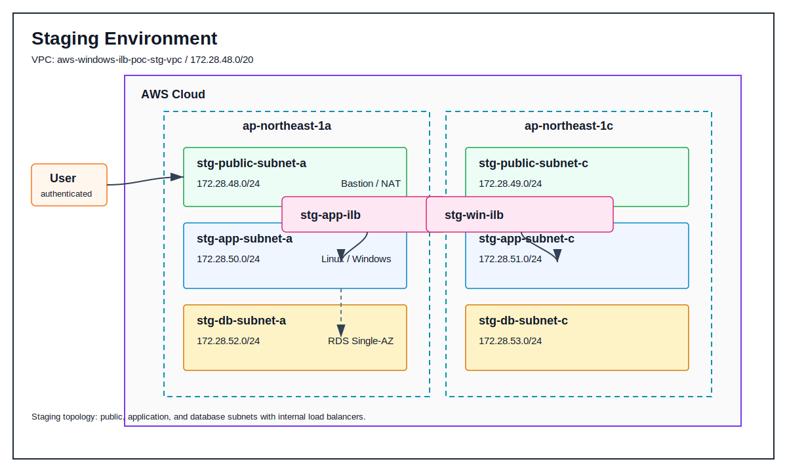

# アーキテクチャ

## 概要

このドキュメントでは、Windows Server と内部ロードバランサーを含む AWS 基盤構成を、ケーススタディとして整理します。

 

## 検証環境

検証環境は、接続経路、アプリケーション動作、DB接続を確認するための最小構成です。

| 項目 | 内容 |
| --- | --- |
| VPC CIDR | `172.28.48.0/20` |
| Public Subnet | `172.28.48.0/24` / `172.28.49.0/24` |
| Private App Subnet | `172.28.50.0/24` / `172.28.51.0/24` |
| Private DB Subnet | `172.28.52.0/24` / `172.28.53.0/24` |
| Linux Server | 1台 |
| Windows Server | 1台 |
| Internal ALB | Linux 用 / Windows 用 |
| RDS | PostgreSQL / Single-AZ |

 

## 本番環境

本番環境は、2AZ 構成、NAT Gateway x2、Linux / Windows Server の複数台構成、RDS Multi-AZ を前提にしています。

| 項目 | 内容 |
| --- | --- |
| VPC CIDR | `172.28.32.0/20` |
| Public Subnet | `172.28.32.0/24` / `172.28.33.0/24` |
| Private App Subnet | `172.28.34.0/24` / `172.28.35.0/24` |
| Private DB Subnet | `172.28.36.0/24` / `172.28.37.0/24` |
| NAT Gateway | AZごとに1台 |
| Linux Server | 2台 |
| Windows Server | 2台 |
| Internal ALB | Linux 用 / Windows 用 |
| RDS | PostgreSQL / Multi-AZ |

 

## 環境差分

| 観点 | 検証環境 | 本番環境 |
| --- | --- | --- |
| 目的 | 接続経路、アプリケーション動作、DB接続の確認 | 可用性、運用性、障害時の影響範囲を考慮した構成 |
| サーバー台数 | Linux / Windows をそれぞれ最小構成 | Linux / Windows をそれぞれ 2AZ に配置 |
| NAT Gateway | 最小構成 | AZごとに配置 |
| Load Balancer | 動作確認用 | Linux / Windows の接続先を内部LBへ集約 |
| RDS | Single-AZ | Multi-AZ |
| 運用 | 手順確認を重視 | メンテナンス、切り離し、障害時対応を考慮 |

 

## 内部ロードバランサーの設計意図

本番環境で内部ロードバランサーを利用する主な理由は、外部公開しない業務アプリケーション層に対して、安定した内部接続先を提供するためです。

| 理由 | 内容 |
| --- | --- |
| 非公開構成 | Linux / Windows Server を Private Subnet に配置し、インターネットから直接到達させない |
| 可用性 | 複数台のサーバーへ通信を分散する |
| 固定接続先 | 利用側は個別サーバーではなく、内部LBのDNS名を接続先にできる |
| ヘルスチェック | 異常なインスタンスを振り分け対象から外せる |
| メンテナンス性 | 対象サーバーをLB配下から外し、影響範囲を抑えて作業できる |
| セキュリティ境界 | Public Subnet、Private App Subnet、Private DB Subnet の責務を分離できる |

 

## 主な AWS リソース

| リソース | 役割 |
| --- | --- |
| VPC | システム全体のネットワーク境界 |
| Public Subnet | 踏み台、NAT Gateway など外部接続を扱うリソースを配置 |
| Private App Subnet | Linux / Windows Server を配置 |
| Private DB Subnet | RDS を配置 |
| Internal ALB | Private Subnet 内のアプリケーション層へ内部向けに負荷分散 |
| EC2 | 踏み台、Linux Server、Windows Server |
| RDS | アプリケーション用データベース |
| Security Group | 通信元、通信先、ポートを役割単位で制御 |

 

## CloudFormation サンプルの補足

[templates/stg-windows-ilb.yaml](../templates/stg-windows-ilb.yaml) では、検証環境をもとにした最小構成を作成します。

[templates/prod-windows-ilb.yaml](../templates/prod-windows-ilb.yaml) では、本番環境をもとにした複数台構成を作成します。

Linux Server には Apache HTTP Server、Windows Server には IIS と簡易HTMLを配置します。

これは PoC として、Internal Load Balancer のヘルスチェックと振り分けを確認しやすくするための最小実装です。
