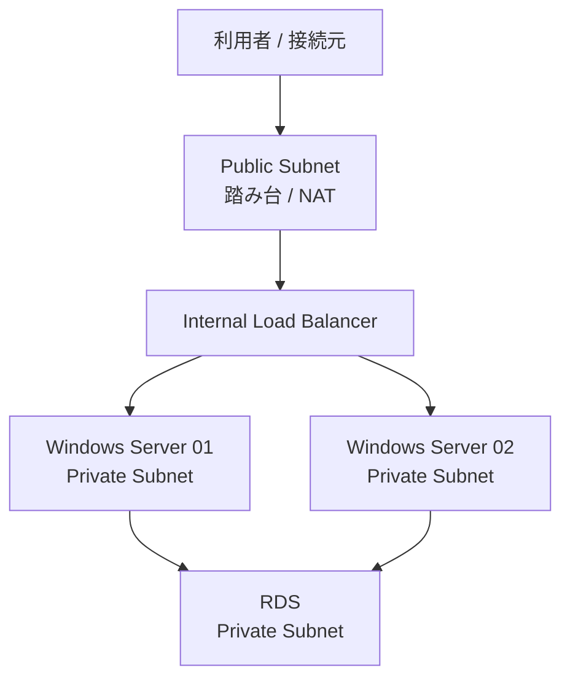

# アーキテクチャ

## 概要

このドキュメントでは、Windows Server を含む業務アプリケーション基盤を、公開可能なケーススタディとして抽象化しています。

実環境のリソース名、IPアドレス、インスタンスID、顧客情報、拠点情報は記載しません。

## 想定アーキテクチャ

## 検証環境と本番相当環境

| 観点 | 検証環境 | 本番相当環境 |
| --- | --- | --- |
| 目的 | 接続経路、アプリケーション動作、DB接続の確認 | 可用性、運用性、障害時の影響範囲を考慮した構成 |
| サーバー台数 | 最小構成 | 複数台構成 |
| ロードバランサー | 必要最小限または未使用 | 内部ロードバランサーでPrivate Subnet内の通信を集約 |
| ネットワーク | 構成確認を重視 | Public / Private Subnet 分離を重視 |
| 運用 | 手順確認 | メンテナンス、切り離し、障害時対応を考慮 |

## 内部ロードバランサーの設計意図

本番相当環境で内部ロードバランサーを利用する主な理由は、外部公開しない業務アプリケーション層に対して、安定した内部接続先を提供するためです。

| 理由 | 内容 |
| --- | --- |
| 非公開構成 | Windows ServerをPrivate Subnetに配置し、インターネットから直接到達させない |
| 可用性 | 複数台のWindows Serverへ通信を分散する |
| 固定接続先 | 利用側は個別サーバーではなく、内部LBのDNS名を接続先にできる |
| ヘルスチェック | 異常なインスタンスを振り分け対象から外せる |
| メンテナンス性 | 対象サーバーをLB配下から外し、影響範囲を抑えて作業できる |
| セキュリティ境界 | Public Subnet、Private Subnet、DB層の責務を分離できる |

## 主なAWSリソース

| リソース | 役割 |
| --- | --- |
| VPC | システム全体のネットワーク境界 |
| Public Subnet | 踏み台やNATなど、外部接続を扱うリソースを配置 |
| Private Subnet | Windows ServerやDB接続先を配置 |
| Internal Load Balancer | Private Subnet内のアプリケーション層へ内部向けに負荷分散 |
| EC2 | Windows Server、踏み台、アプリケーションサーバー |
| RDS | アプリケーション用データベース |
| Security Group | 通信元、通信先、ポートを役割単位で制御 |

## CloudFormationサンプルの補足

[templates/prod-windows-ilb.yaml](../templates/prod-windows-ilb.yaml) では、Windows Server 2台にUserDataでIISと簡易HTMLを配置します。

これは公開用PoCとして、Internal Load Balancer のヘルスチェックと振り分けを確認しやすくするための最小実装です。実務構成のアプリケーションや設定を再現するものではありません。

## 公開用に抽象化した点

| 実務構成に含まれる可能性がある情報 | 公開用での扱い |
| --- | --- |
| 実リソース名 | サンプル名へ置換 |
| 実CIDR / IPアドレス | サンプルCIDRへ置換 |
| EC2インスタンスID | 記載しない |
| 顧客名 / 案件名 / 拠点名 | 記載しない |
| 実運用の接続先 | 役割ベースで説明 |
| 業務PPTX原本 | リポジトリに含めない |
